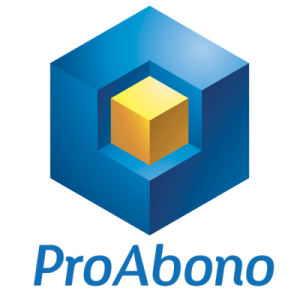

<h1 align="center">PHP Client Library for the ProAbono API</h1>

     
    
     

 

    
    
    
    

## About

The ProAbono PHP Client Library is an open source library to interact with ProAbono’s subscription management from your PHP website. This library interacts with the ProAbono Live API.

## Installation

> Package frozen on [Packagist.org](https://packagist.org/packages/proabono/proabono-php) due to an error with credentials between WSL and GitHub.

## Configuration

In the ProAbono back office, open the top right menu by clicking your name, then select Integration. Note the 4 values : keyAgent, keyApi, endpoint, public pricing url.

In a config.php file, you need to set the 4 ProAbono Settings :

- keyAgent (ex: ce0d53ed-19b6-423c-bf0f-2076e4886758)
- keyApi (ex: 83d47ce5-ae32-4895-82e1-151cb7297914)
- endpoint (ex: https://api-42.proabono.com)
- public pricing url (ex: https://demo-php-eur.proabono.com/pricing)

## Documentation

Read the [ProAbono API documentation](https://docs.proabono.com/api/#introduction) for more information about the API.

## Changelog

All notable changes to this project will be documented in the [CHANGELOG](./CHANGELOG.md) file.

## License

This project is released under [the MIT License](./LICENSE.md).
